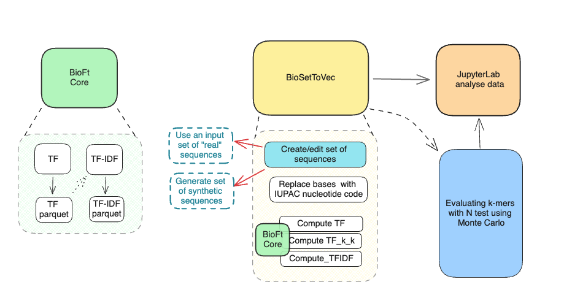

# BioSet2Vec

**BioSet2Vec** is a tool designed to extract k-mer dictionaries from multiple sets of biological sequences using distributed computing. This method is efficient for large-scale biological sequence analysis, enabling users to handle diverse sequence sets, such as DNA sequences, and extract k-mer representations in a distributed fashion. The extracted k-mer dictionaries can be used for downstream tasks like sequence comparison, feature extraction, and machine learning.




## Features

- **Distributed k-mer extraction**: Handles multiple biological sequence sets.
- **Scalability**: Optimized for large datasets using distributed computation.
- **Flexible k-mer size**: Adjustable k-mer lengths to suit the user’s specific needs.
- **Support for various biological sequences**: Compatible with DNA sequences.
- **Efficient I/O handling**: Works with large files in FASTA, FASTQ, or other common biological sequence formats.
- **Easy setup with JSON configuration**: Use an `input.json` file to manage configuration parameters.

## Requirements

- Python ">=3.8,<3.9"
- JDK 8
- [Apache Spark](https://spark.apache.org/) (for distributed computing) version 3.5.1
- bioft.jar from https://github.com/Ylenia1211/Bioft.git

Operating system(s): Platform independent

## Installation

1. Install and setup JAVA:

    To install Liberica JDK 1.8.0_422 on your system, you can follow the instructions provided in the official Liberica documentation https://bell-sw.com/pages/downloads/#jdk-8-lts. Once the installation is complete, make sure to configure your development environment to point to the new Java installation.

```bash
        /usr/libexec/java_home -V
        export JAVA_HOME=`/usr/libexec/java_home -v 1.8.0_422-b06`
        nano ~/.zshrc
        export JAVA_HOME=$(/usr/libexec/java_home -v 1.8.0_422-b06)
```
Press CTRL+X to exit the editor Press Y to save your changes and check:
        
```bash        
        source ~/.zshrc
        echo $JAVA_HOME
        java -version
 
```
2. Set up Apache Spark version 3.5.1:

    Follow the [official guide](https://spark.apache.org/docs/latest/index.html) to set up Apache Spark in your environment.
   

4. Clone the repository:

    ```bash
    git clone https://github.com/Ylenia1211/BioSet2Vec.git
    cd BioSet2Vec
    ```
    
5. Place `bioft.jar` in the working directory:

   `bioft.jar` is required for your job, download and place it in your project directory.

   ```bash
   cp /path/to/bioft.jar ./bioset2vec/bioft.jar
   ```

6. Install the library "BioVec2Set" (with the dependencies):

    ```bash
     pip install bioset2vec/dist/bioset2vec-0.1.0-py3-none-any.whl --force-reinstall
    ```

### Configuration 
Configure BioSet2Vec by creating an input.json file with the following parameters:
```json
    {
        "path_jar": "./bioset2vec/bioft.jar",
        "folder_path": "./set_synthetic/",
        "k_min": 3,
        "k_max": 4,
        "n": 0, 
        "n_core": 6,
        "ram": 6,
        "offHeap_size": 2
    }
```

### Parameter Details

**path_jar**: Path to the bioft.jar file.

**folder_path**: Path to the folder containing sequence sets.

**k_min** and **k_max**: Minimum and maximum k-mer lengths.

**n**: number of time to perform test Montecarlo (if you want to use the package only to perform an easy TFIDF on your input sets set  "n": 0).

**n_core**: Number of CPU cores to use.

**ram**: RAM in GB for Spark.

**offHeap_size**: Off-heap memory size in GB.


### Usage


You can use the functionality directly in your Python scripts:

```python
from bioSet2Vec import BioSet2Vec

# Configure BioSet2Vec 
input_file = "input.json"
params = BioSet2Vec.read_parameters_from_file(input_file)

#Running TF-IDF transformation and saving results
BioSet2Vec.compute(params)
```
## Other Examples

For a hands-on example of how to use **BioSet2Vec**, check out the [notebooks/example_notebook.ipynb](notebooks/example_notebook.ipynb) in the `notebooks` folder.

## Citation

If you use **BioSet2Vec** in your research or project, please cite the tool as follows:

```bibtex
@misc{BioSet2Vec,
  author = {Ylenia Galluzzo, Raffaele Giancarlo, Simona E. Rombo, Filippo Utro},
  title = {BioSet2Vec: extraction of k-mer dictionaries from multiple sets of biological sequences in the distributed},
  year = {2024},
  url = {#in review},
  note = {GitHub repository}
}
